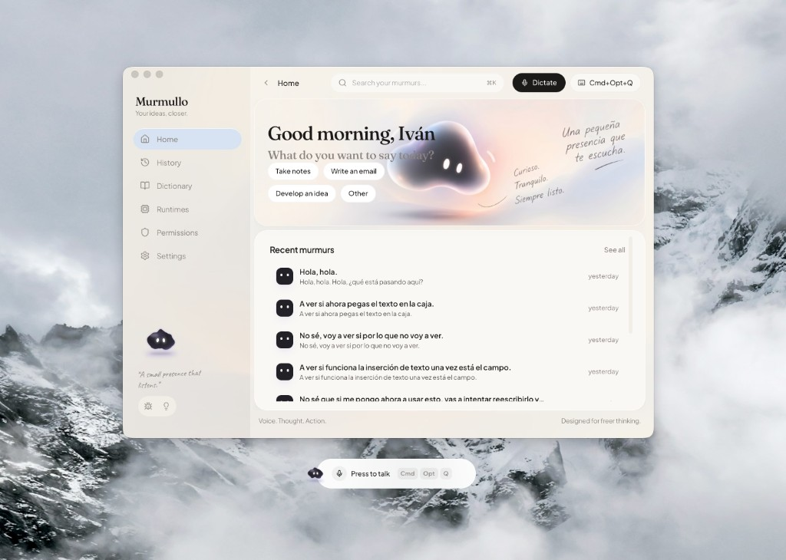

# Murmullo

**Your ideas, closer.** Offline voice dictation for the Mac — a small presence that listens.

Hold a shortcut, speak, release. Murmullo transcribes on your machine with **nemo-speech + Parakeet
TDT 0.6B v3**, optionally rewrites with a local LLM and your dictionary, then pastes into the app
you were already using.



**Supported today:** macOS 12+. Pasting into the focused app on Windows and Linux is not implemented
yet.

Signed disk images and store packages come later. Until then, clone this repository and run the
[guided installer](#install-from-the-repository).

## What to do with it

Murmullo is meant to stay out of the way. The main window is a **workstation**, not the recorder.
Close it; dictation keeps working from the tray and the overlay.

1. Grant **microphone**, **Input Monitoring**, and **Accessibility** (Permissions page).
2. On **Runtimes**, install nemo-speech and download Parakeet Q8 (~714 MB), then start STT.
3. Click a text field in Slack, Mail, Notes, Cursor — anywhere.
4. Hold **`⌘ ⌥ T`** (default; change it in Settings), speak, release.
5. Corrected text is pasted at the caret. Raw STT and the final line land in History.

Full walkthrough (models, dictionary, Settings): [docs/USAGE.md](docs/USAGE.md). Typical uses: notes
while walking around the keyboard, drafting mail, thinking out loud, capturing an idea before it
evaporates. The companion on Home is only a presence. The work happens in the other app.

| Page        | What it is                                                  |
| ----------- | ----------------------------------------------------------- |
| Home        | Greeting, recent murmurs, a way back into the last take     |
| History     | Searchable raw STT and final text                           |
| Dictionary  | Terms that reshape the rewrite prompt (names, jargon, tone) |
| Runtimes    | STT / GGUF / optional LLM installer and logs                |
| Permissions | macOS microphone, shortcut, and paste                       |
| Settings    | Hotkey, mic, overlay style, theme, locale, LLM              |

The overlay is a HUD: idle, recording, processing, done, error, plus Record / Stop / Cancel. The
system hotkey remains the primary trigger so Murmullo never has to steal focus.

Optional **Ollama** (or Kimi / Kilo / Cursor / Claude): if it is down, dictation still pastes STT +
dictionary. Learning does not live in the speech model. Parakeet is not fine-tuned; the dictionary
and prompt are the layer that corrects itself.

## Install from the repository

```bash
git clone https://github.com/ivrusson/murmullo.git
cd murmullo
./install.sh          # macOS / Linux — or double-click install.command on a Mac
```

```powershell
git clone https://github.com/ivrusson/murmullo.git
cd murmullo
.\install.cmd         # or: powershell -ExecutionPolicy Bypass -File .\install.ps1
```

The assistant is bilingual (Spanish if `LANG` starts with `es`). It checks git, Xcode Command Line
Tools, Node.js 18+, Rust, and pnpm, offers to install what is missing, then runs `pnpm install`. It
can compile (`--build`) or launch (`--dev`). It does **not** fetch the 714 MB speech model — that
stays a first-run step in Runtimes, with checksums.

Flags and troubleshooting: [docs/INSTALL.md](docs/INSTALL.md). Using the app, models, and Settings:
[docs/USAGE.md](docs/USAGE.md).

### Requirements

- macOS 12+ (dictation)
- Rust stable (via rustup)
- Node.js 18+
- pnpm

## Development

If the toolchain is already there:

```bash
pnpm install
pnpm tauri dev
```

Production compile:

```bash
pnpm tauri build
```

Frontend-only: `pnpm dev`, `pnpm build`, `pnpm lint`, `pnpm type-check`.

Architecture: [spec/REWRITE.md](spec/REWRITE.md). Why the code looks this way:
[spec/DECISIONS.md](spec/DECISIONS.md). Visual tokens: [DESIGN.md](DESIGN.md). Start here:
[spec/START-HERE.md](spec/START-HERE.md).

Murmullo is a thin desktop wrapper, not an inference engine:

- **RuntimeManager** starts/stops `nemo-speech serve` and an optional local LLM on localhost
- **AudioCapture** records 16 kHz audio with a speech gate
- **HTTP STT** `POST /v1/audio/transcriptions` against Parakeet Q8 GGUF
- **Dictionary + PostProcessor** deterministic replacements, then optional LLM rewrite
- **TextInserter** clipboard + Cmd+V on the macOS main thread
- Overlay + tray for hold-to-talk without stealing focus

The GGUF lives under `~/.murmullo/models/`. How the speech model, dictionary, and optional LLM fit
together: [docs/USAGE.md](docs/USAGE.md).

## What's next

Murmullo is **beta** (`0.x`). The next product work is packaging, then the rest of the desktop:

- **Native installers** — signed `.dmg` / `.app` on macOS, then Windows and Linux packages, so
  cloning the repo is no longer the default path
- **`nemo-speech` as a Tauri `externalBin`** — fewer moving pieces on first run
- **Paste on Windows and Linux** — same hold-to-talk promise as on the Mac
- **LLM runtimes beyond Ollama HTTP** — keep rewrite local and optional

Out of scope for now: fine-tuning Parakeet, streaming / live captions, and any cloud STT or cloud
LLM as a dependency.

## License

MIT. See [LICENSE](LICENSE).

## Acknowledgments

Murmullo stands on other people's open source. Thank you.

### Speech

- [NeMo-Speech.cpp](https://github.com/NVIDIA/NeMo-Speech.cpp) — local OpenAI-compatible ASR server
- [Parakeet TDT 0.6B v3](https://huggingface.co/nvidia/parakeet-tdt-0.6b-v3) — NVIDIA multilingual
  ASR (Q8 GGUF)

### Desktop shell

- [Tauri](https://tauri.app/) — the app shell, tray, and webview
- [tauri-plugin-global-shortcut](https://github.com/tauri-apps/plugins-workspace) — hold-to-talk
- [tauri-plugin-clipboard-manager](https://github.com/tauri-apps/plugins-workspace) — clipboard
- [tauri-plugin-opener](https://github.com/tauri-apps/plugins-workspace) — open GitHub feedback
- [tauri-plugin-macos-permissions](https://github.com/ahkohd/tauri-plugin-macos-permissions) —
  microphone / Accessibility / Input Monitoring
- [cpal](https://github.com/RustAudio/cpal) — microphone capture
- [hound](https://github.com/ruuda/hound) — WAV
- [rubato](https://github.com/HEnquist/rubato) — resampling to 16 kHz
- [enigo](https://github.com/enigo-rs/enigo) — Cmd+V
- [arboard](https://github.com/1Password/arboard) — clipboard buffer
- [global-hotkey](https://github.com/tauri-apps/global-hotkey) — system shortcut
- [tokio](https://tokio.rs/) — async runtime
- [reqwest](https://github.com/seanmonstar/reqwest) — STT HTTP and NVIDIA downloads
- [serde](https://serde.rs/) — config and IPC
- [macos-accessibility-client](https://github.com/nashaofu/macos-accessibility-client) — paste
  permission
- [objc2](https://github.com/madsmtm/objc2) — AppKit / Foundation on the main thread

### Interface

- [React](https://react.dev/)
- [StyleX](https://stylexjs.com/) — typed atomic CSS
- [Base UI](https://base-ui.com/) — accessible primitives
- [TanStack Router](https://tanstack.com/router) — hash routes in the webview
- [Lucide](https://lucide.dev/) — icons
- [Three.js](https://threejs.org/) — optional 3D companion
- [Vite](https://vite.dev/) — frontend toolchain
- [ahooks](https://ahooks.js.org/)
- [next-themes](https://github.com/pacocoursey/next-themes)

### Type

- [Plus Jakarta Sans](https://fonts.google.com/specimen/Plus+Jakarta+Sans),
  [Fraunces](https://fonts.google.com/specimen/Fraunces),
  [Newsreader](https://fonts.google.com/specimen/Newsreader),
  [Caveat](https://fonts.google.com/specimen/Caveat) — SIL Open Font License, served by Google Fonts

### Optional rewrite

- [Ollama](https://ollama.com/) — local LLM HTTP, used when you want a rewrite on top of the
  dictionary
